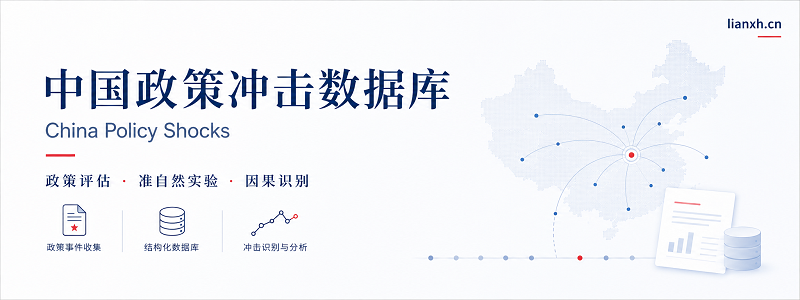

{.hero-cover fig-alt="China Policy Shocks：中国政策冲击数据库"}

# 中国政策冲击数据库

本项目整理中国经管实证研究中常用或有潜力的政策冲击。重点不是罗列政策名称，而是说明每项政策如何转化为处理组、对照组、冲击时间、数据合并键和识别设计。

[查看政策汇编](appendix_policy_list.html){.btn .btn-primary}
[下载 Excel](data/policy_shock_library_v0_1.xlsx){.btn .btn-outline-primary}
[下载 CSV](data/policy_shock_library_v0_1.csv){.btn .btn-outline-secondary}
[访问连享会](https://www.lianxh.cn){.btn .btn-outline-danger}

## 项目入口

::: {.home-grid}

::: {.home-card}
### 数据库

下载和查看政策冲击主表，包括政策名称、领域、处理组定义、冲击时间、合并键、推荐方法和识别风险。

[进入数据库](database.html)
:::

::: {.home-card}
### 政策汇编

按研究领域分组浏览政策冲击，适合快速检索「某个领域有哪些政策冲击可以用」。

[浏览政策汇编](appendix_policy_list.html)
:::

::: {.home-card}
### 方法说明

说明如何判断一个政策是否能转化为可估计的处理变量，以及 DID、DDD、事件研究和暴露度设计的适用边界。

[查看方法说明](methods.html)
:::

::: {.home-card}
### 连享会资源

整理连享会与政策评估、因果推断、论文复现和实证研究设计相关的推文，作为扩展阅读入口。

[查看推文资源](lianxh_resources.html)
:::

:::

## 如何使用

- 若只是查找政策冲击，建议先看「政策汇编」。
- 若需要下载和筛选完整字段，建议使用 Excel 或 CSV。
- 若想学习如何把政策文件转化为处理变量，建议阅读「方法说明」和「政策卡片」。
- 若需要进一步学习 DID、IV、RDD、合成控制和论文复现，可进入「连享会资源」。

## 关于连享会

本项目由连享会维护。更多经管实证研究、Stata、Python、因果推断和论文复现资料，见 [连享会主页](https://www.lianxh.cn)。
